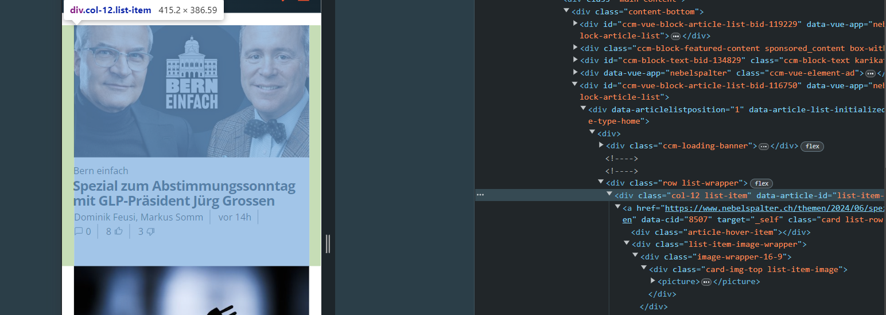

Seite: https://www.nebelspalter.ch/

Die Tags sind nicht so gut, da ein Bild in 3 divs verpackt ist, welche nur als Styling dienen. Das Bild ist in einem div, welches in einem weiteren div ist, welches in einem weiteren div ist. Auch allgemein haben die h1s und ps alle div herum und es wurden keine articel für artikel verwendet.
