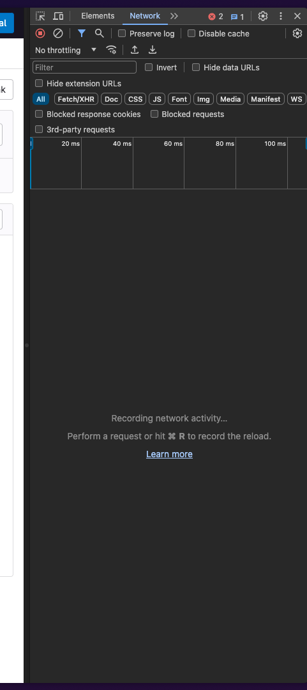
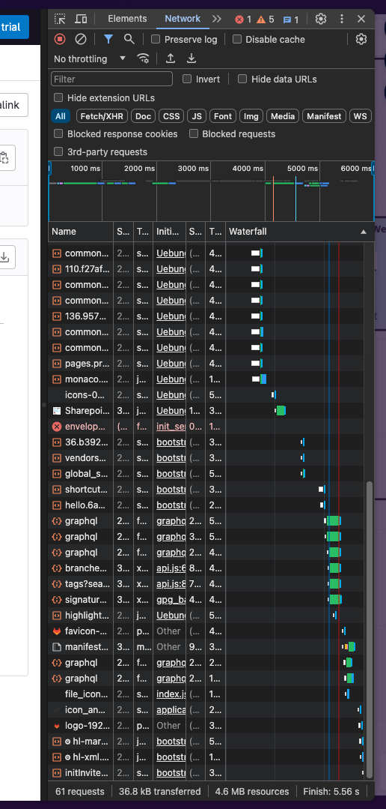

# 1.
This is the chrome network panel. it shows all network requests. It is empty since theres been no requests since the website was already loaded when i opened it.

After reloading the page it is full of requests. these are all requests the browser had to make to display the current webpage

Here, you can clear the Network tab from previous requests:

# 2.
When inspecting something with the chrome devtools you can see and edit HTML elements. in some it can happen that you select a parent component instaid of the child you're trying to inspect.
