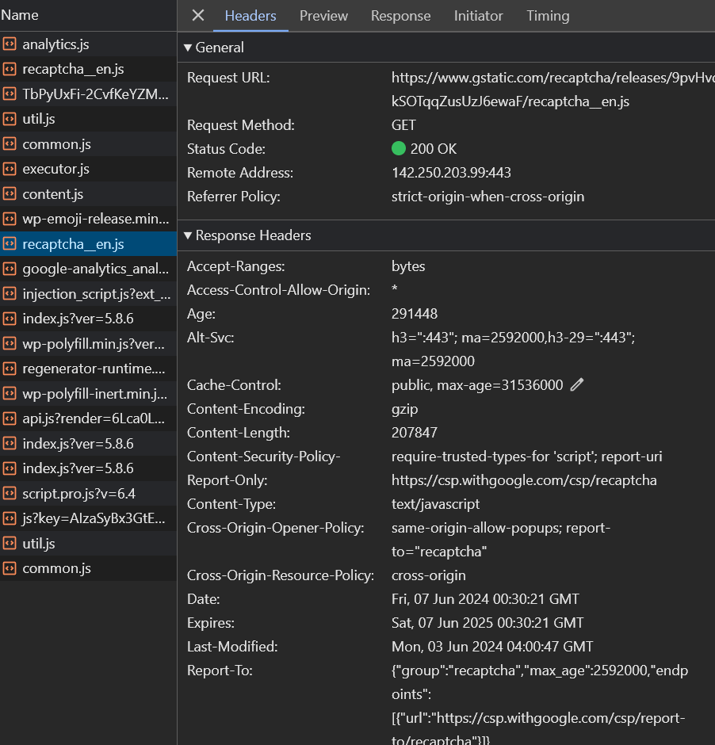

1. Devtools
   JS:
   

2. Ports
   Bei port 80 und 443 funktioniert es, wenn ich den port 80 angebe werde ich automatisch von http (80) zu https (443) umleiten.
   ich kriege ein error wenn https auf port 80 versuche
3. Anker
   Link mit anker:
   https://gitlab.com/ch-tbz-it/Stud/m293g/m293/-/blob/main/T3_Protokoll/Uebungen.md#%C3%BCbung-3---anker
